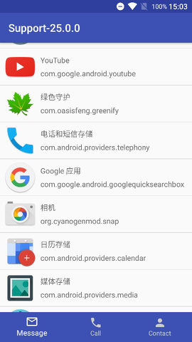

# Support Library 25.0.0

伴随着Android 7.1(API 25)的的发布，一系列相关的开发工具与套件也一起更新了，包括Android Studio 2.2.2与Support Library 25.0.0。其中AS的更新包括日常的bug修复与性能提升，还有对7.1的支持。而Support包的更新如下：  

## Important changes

* `ContextCompat`的构造方法变为protected
* `ActivityCompat`的构造方法变为protected
* `ActivityCompat`的`getReferer(Activity)`方法变为static
* 删除方法`android.support.design.widget.CoordinatorLayout.Behavior.isDirty(CoordinatorLayout, V)`
* 删除方法`android.support.v4.media.session.MediaSessionCompat.obtain(Context, Object)`
* 删除方法`android.support.v4.media.session.MediaSessionCompat.QueueItem.obtain(Object)`
* 删除方法`android.support.v7.widget.Space`,应当使用`android.support.v4.widget.Space.`(作者注：在布局需要空白View时很高效)

## New APIs

* 新增`android.support.design.widget.BottomNavigationView`类(更新的主角)，实现了Material Design中的[bottom navigation](https://material.google.com/components/bottom-navigation.html)设计样式，就是我们常见的底部tab栏
* 新增`android.support.v13.view.inputmethod`包，其中的相关类实现了在API 13时引入的`android.view.inputmethod.InputConnection`特性
* 新增`android.v7.widget.RecyclerView.DividerItemDecoration`类，提供RecyclerView分割线的一种基础实现，目前只支持`LinearLayoutManager`的横向和纵向布局
* 将API 24中引入的自定义Notification布局的相关类加入到兼容包中，即`DecoratedCustomViewStyle`和`DecoratedMediaCustomViewStyle`

## 功能预览



作者第一时间尝试了其中的部分新API，交互效果真的很棒！下面大概说下使用方式：  
首先在布局中引入`BottomNavigationView`,  
```xml
<android.support.design.widget.BottomNavigationView
        android:id="@+id/navigation"
        android:layout_width="match_parent"
        android:layout_height="wrap_content"
        android:layout_alignParentBottom="true"
        android:background="@color/colorPrimary"
        design:itemIconTint="@color/item_text_color"
        design:itemTextColor="@color/item_text_color"
        design:menu="@menu/menu_navigation"/>
```
可以看到使用了design的三个自定义attr，`menu`是用来指定tab栏中的各个tab的，官方说tab数量应该介于3个到5个之间，所以这里以3个item为例，测试menu如下   

```xml
<?xml version="1.0" encoding="utf-8"?>
<menu xmlns:android="http://schemas.android.com/apk/res/android">
    <item
        android:id="@+id/item1"
        android:checked="true"
        android:icon="@drawable/ic_mail_outline_black_24dp"
        android:title="Message"/>

    <item
        android:id="@+id/item2"
        android:icon="@drawable/ic_call_black_24dp"
        android:title="Call"/>

    <item
        android:id="@+id/item3"
        android:icon="@drawable/ic_person_black_24dp"
        android:title="Contact"/>
</menu>
```

`itemTextColor`是指定tab下的文字颜色的，这里使用了selector，  
```xml
<?xml version="1.0" encoding="utf-8"?>
<selector xmlns:android="http://schemas.android.com/apk/res/android">
    <item android:color="#fff" android:state_checked="true"/>
    <item android:color="#fff" android:state_pressed="true"/>
    <item android:color="#ccc"/>
</selector>
```

`itemIconTint`是为tab里的icon着色，这里使用了跟文字相同的颜色效果。

代码中就比较简单了：  
```java
navigationView = (BottomNavigationView) findViewById(R.id.navigation);
        navigationView.setOnNavigationItemSelectedListener(new BottomNavigationView.OnNavigationItemSelectedListener() {
            @Override
            public boolean onNavigationItemSelected(@NonNull MenuItem item) {
                Toast.makeText(MainActivity.this, item.getTitle(), Toast.LENGTH_SHORT).show();
                return false;
            }
        });
```

而上方的应用列表则使用RecyclerView，并搭配了新的divider类：  
```java
mRecyclerView = (RecyclerView) findViewById(R.id.recyclerview);
        mLayoutManager = new LinearLayoutManager(this);
        mRecyclerView.setLayoutManager(mLayoutManager);
        mAdapter = new AppInfoAdapter(this, getAppInfo(), R.layout.item_app_info);
        mRecyclerView.setAdapter(mAdapter);
        // New in recyclerview-25.0.0
        mRecyclerView.addItemDecoration(new DividerItemDecoration(this, mLayoutManager.getOrientation()));
```

## 结语

介绍就到这里了，示例demo的代码在[这里(github)]()，欢迎大家下载体验。
